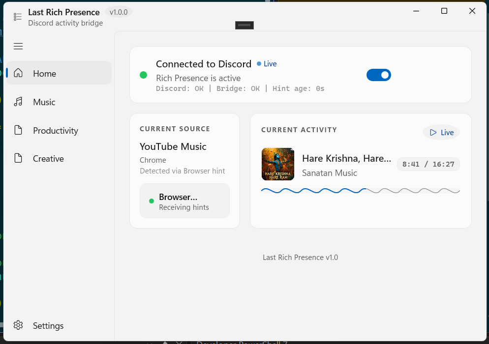

<div align="center">
  

  <h1>Last Rich Presence</h1>
  <p><strong>Windows app for accurate, polished Discord Rich Presence from desktop and browser media.</strong></p>

  <p>
    
    
    
    
  </p>
</div>

## What It Does

Last Rich Presence keeps your Discord status aligned with what you are listening to or watching, using Windows media sessions and an optional browser companion extension for higher-fidelity web player timelines.

## Interface Preview

<p align="center">
  
</p>

## Highlights

### Desktop App

- Detects active media sessions via GSMTC.
- Builds rich Discord presence with title, artist, timeline, and playback state.
- Uses timeline quality arbitration to avoid stale or incorrect timestamps.
- Includes polished WinUI animations, activity cards, and wave timeline visuals.
- Adds privacy controls for sensitive content and browser-source handling.
- Provides diagnostics plus settings export/import.

### Optional Browser Extension

- Sends high-confidence media hints from web players to the desktop app.
- Uses token-based local transport (`/v1/browser-hint/token`, `/v1/browser-hint`).
- Provides popup controls to enable/disable sources and view forwarding state.

### Supported Web Sources (Extension)

YouTube, YouTube Music, Spotify Web, SoundCloud, Apple Music (web), Amazon Music (web), Deezer, TIDAL, JioSaavn, Gaana, Wynk Music, Bandcamp, Mixcloud, and Twitch media pages.

## Requirements

- Windows 10/11
- Visual Studio 2026 with Desktop development for C++
- Node.js (used by verification for extension syntax checks)

## Build

1. Open `Last Rich Presence.sln` in Visual Studio 2026.
2. Select `Debug` or `Release` and a platform such as `x64`.
3. Build the solution.
4. Run the app from Visual Studio.

## Verify Locally

PowerShell:

```powershell
.\scripts\verify.ps1
```

CMD:

```cmd
.\scripts\verify.cmd
```

Optional configuration:

```powershell
.\scripts\verify.ps1 -Configuration Release -Platform x64
```

The script runs solution build, extension JavaScript syntax checks, and test artifact discovery.

## Browser Extension Setup (Optional)

1. Open `chrome://extensions` or `edge://extensions`.
2. Enable **Developer mode**.
3. Click **Load unpacked**.
4. Select the `browser-extension/` folder.

## Project Structure

```text
Last Rich Presence/
|- src/
|  |- core/                 # Detection, presence building, Discord IPC
|  |- ui/                   # WinUI pages, navigation, settings, animations
|- browser-extension/       # Optional MV3 companion extension
|- scripts/                 # Verification scripts
|- Assets/                  # App logos and package images
|- Last Rich Presence.sln   # Visual Studio solution
```

## Troubleshooting

- If build fails with `LNK1201`, close any running app instance and stop locked `mspdbsrv` processes, then rebuild.
- If extension changes do not appear, reload the unpacked extension.
- If Rich Presence does not update, ensure Discord desktop is running.

## Roadmap

- Expand integrations in `Productivity` and `Creative` categories.
- Continue timeline and source-detection accuracy improvements.
- Improve release packaging and docs.
