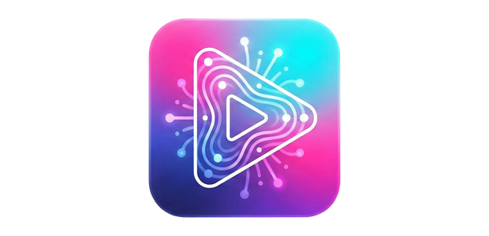
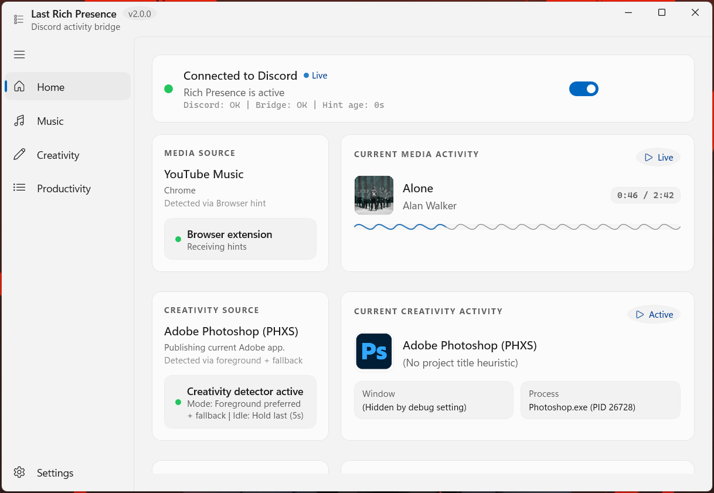

<div align="center">
  

  <h1>Last Rich Presence</h1>
  <p><strong>Windows app for accurate, polished Discord Rich Presence for media, creative, and productivity workflows.</strong></p>

  <p>
    
    
    
    
  </p>
</div>

## What It Does

Last Rich Presence keeps your Discord status aligned with what you are doing on Windows across three activity lanes:

- Media playback via Windows media sessions, with optional browser companion hints for better web timeline accuracy.
- Creative app activity via Adobe-family desktop app detection.
- Productivity app activity via Microsoft Office desktop app detection.

## Interface Preview

<p align="center">
        
</p>

## What's New in v2.0.0

- Dedicated `Creativity` and `Productivity` pages, detectors, and Discord presence pipelines.
- Per-category controls for detection mode, activity type, privacy, and app filtering.
- Tray/startup reliability improvements for unpackaged (`Inno`) installs.
- Split release profiles: `Release-Inno` and `Release-MSIX`.

## Highlights

### Desktop App

- Detects active media sessions via GSMTC.
- Builds rich Discord presence with title, artist, timeline, and playback state.
- Uses timeline quality arbitration to avoid stale or incorrect timestamps.
- Adds dedicated `Creativity` and `Productivity` pipelines with their own detectors and Discord app IDs.
- Supports per-category detection modes, privacy modes, app filters, and activity type overrides.
- Includes tray behavior controls (`close to tray`, `launch on startup`, `start minimized to tray`) with persistence.
- Includes polished WinUI animations, activity cards, and wave timeline visuals.
- Supports App Theme Mode (Light, Dark, and System Default).
- Adds privacy controls for sensitive content and browser-source handling.
- Provides diagnostics plus settings export/import.

### Creativity Mode

- Detects Adobe-family desktop workflows from active/visible windows.
- Detection modes: `ForegroundPreferredVisibleFallback`, `ForegroundOnly`, `VisibleWindowOnly`.
- Privacy modes: `Normal`, `AppOnly`, `Private`.
- Controls for showing project name and window title.
- Idle behavior options and media-vs-creativity priority controls.

### Productivity Mode

- Detects Microsoft Office workflows from active/visible windows.
- Detection modes: `ForegroundPreferredVisibleFallback`, `ForegroundOnly`, `VisibleWindowOnly`.
- Privacy modes: `Normal`, `AppOnly`, `Private`.
- Controls for showing project name and window title.
- Activity type override support for Discord display style.

### Optional Browser Extension

- Sends high-confidence media hints from web players to the desktop app.
- Uses token-based local transport (`/v1/browser-hint/token`, `/v1/browser-hint`).
- Provides popup controls to enable/disable sources and view forwarding state.

### Supported Web Sources (Extension)

YouTube, YouTube Music, Spotify Web, SoundCloud, Apple Music (web), Amazon Music (web), Deezer, TIDAL, JioSaavn, Gaana, Wynk Music, Bandcamp, Mixcloud, and Twitch media pages.

### Supported Desktop Sources

- Creativity: Adobe Photoshop, Illustrator, Premiere Pro, After Effects, InDesign, Audition, Media Encoder, Lightroom, Lightroom Classic, InCopy, Dreamweaver, Animate, XD, Bridge, Character Animator, Fresco, Dimension, Substance 3D Painter, Substance 3D Designer, Substance 3D Sampler, Substance 3D Stager, Substance 3D Modeler, Acrobat.
- Productivity: Microsoft Word, Excel, PowerPoint, OneNote, Access, Publisher, Visio, Project.

### Category App Filters

- Creativity filters include individual Adobe app toggles (Photoshop/Illustrator/Premiere/etc.), Acrobat, and Other Adobe.
- Productivity filters include per-app toggles for Word, Excel, PowerPoint, OneNote, Access, Publisher, Visio, and Project.

## Requirements

- Windows 10/11
- Visual Studio 2026 with Desktop development for C++
- Node.js (used by verification for extension syntax checks)
- Inno Setup 6 (optional, for building `.exe` installer output)

## Build

1. Open `Last Rich Presence.sln` in Visual Studio 2026.
2. Select a configuration and platform (`x64` recommended):
   - `Debug` / `Release`: standard development builds.
   - `Release-Inno`: unpackaged, self-contained build for Inno installer publishing.
   - `Release-MSIX`: packaged MSIX build path.
3. Build the solution.
4. Run the app from Visual Studio.

## Manual Release Builds

Build Inno-ready binaries:

```powershell
msbuild "Last Rich Presence.sln" -t:Build -p:Configuration=Release-Inno -p:Platform=x64 -m
```

Compile installer:

```powershell
"C:\Program Files (x86)\Inno Setup 6\ISCC.exe" "installer\LastRichPresence.iss"
```

Installer output:

`dist\LastRichPresence-Setup-x64.exe`

Notes:

- `Release-Inno` is unpackaged + self-contained and intended for Inno Setup release flow.
- Runtime dependencies are copied into the output during `Release-Inno` build for clean-PC compatibility.

Build MSIX profile:

```powershell
msbuild "Last Rich Presence.sln" -t:Build -p:Configuration=Release-MSIX -p:Platform=x64 -m
```

## Verify Locally

PowerShell:

```powershell
.\scripts\verify.ps1
```

CMD:

```cmd
.\scripts\verify.cmd
```

Optional configuration:

```powershell
.\scripts\verify.ps1 -Configuration Release -Platform x64
```

Also supported:

```powershell
.\scripts\verify.ps1 -Configuration Release-Inno -Platform x64
.\scripts\verify.ps1 -Configuration Release-MSIX -Platform x64
```

The script runs solution build, extension JavaScript syntax checks, and test artifact discovery.

## Browser Extension Setup (Optional)

1. Open `chrome://extensions` or `edge://extensions`.
2. Enable **Developer mode**.
3. Click **Load unpacked**.
4. Select the `browser-extension/` folder.

## Project Structure

```text
Last Rich Presence/
|- src/
|  |- core/                 # Detection, presence building, Discord IPC
|  |- ui/                   # WinUI pages, navigation, settings, animations
|- browser-extension/       # Optional MV3 companion extension
|- installer/               # Inno Setup script and installer assets
|- scripts/                 # Verification scripts
|- Assets/                  # App logos and package images
|- Last Rich Presence.sln   # Visual Studio solution
```

## Troubleshooting

- If build fails with `LNK1201`, close any running app instance and stop locked `mspdbsrv` processes, then rebuild.
- If extension changes do not appear, reload the unpacked extension.
- If Rich Presence does not update, ensure Discord desktop is running.
- If startup settings do not apply, verify `HKCU\Software\Microsoft\Windows\CurrentVersion\Run\LastRichPresence`.
- If installer build is unexpectedly tiny, ensure you built `Release-Inno` before compiling Inno setup.

## Roadmap

- Expand app coverage in `Productivity` and `Creative` categories.
- Continue timeline and source-detection accuracy improvements.
- Improve release packaging and docs.
